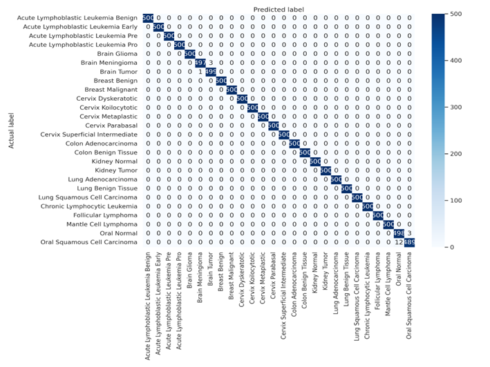
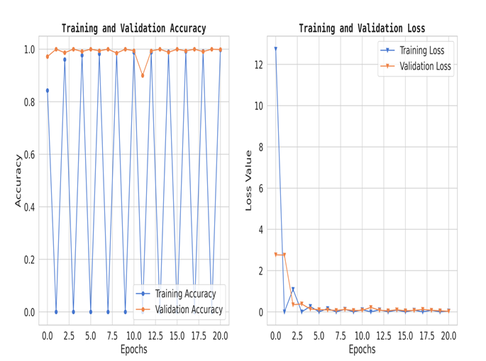

# 🧬 Browser-Based Multi-Cancer Classification Framework Using Depthwise Separable Convolutions for Precision Diagnostics

---

**Authors:** Divine Sebukpor, Ikenna Odezuligbo*, Maimuna Nagey, Michael Chukwuka, Oluwamayowa Akinsuyi (Corresponding Author)
**Preprint DOI:** [https://www.preprints.org/manuscript/202510.1612](https://www.preprints.org/manuscript/202510.1612)
**Live Demo (Hugging Face Space):** [https://huggingface.co/spaces/Sebukpor/multi-cancer-gradcam](https://huggingface.co/spaces/Sebukpor/multi-cancer-gradcam)

---

## Overview

This repository documents our work: **“Browser-Based Multi-Cancer Classification Framework Using Depthwise Separable Convolutions for Precision Diagnostics.”**
We present a unified, browser-accessible AI system capable of detecting multiple cancer types from medical images, offering fast, accurate, and accessible diagnostic assistance via a web interface.

---

## Multi-Cancer Classification Tool

The Multi-Cancer Classification Tool is a machine-learning-powered web application developed by **DAS medhub**.
Users can upload a medical image and receive a predicted cancer type. The inference runs entirely in the browser using TensorFlow.js—no specialised hardware or server-side inference needed.

### Features

* **Multi-Cancer Classification:** Supports classification for 26 cancer types (see list below).
* **Web-based Inference:** Model runs client-side in the browser.
* **Fast & Efficient:** Delivers predictions within seconds.
* **Accessible:** Tailored for clinicians, researchers, and healthcare professionals.

---

## Model Architecture

* **Base architecture:** Xception (pretrained backbone, fine-tuned).
* **Key components:**

  * Depthwise Separable Convolutions for lightweight computation
  * Batch Normalization for stability
  * Dropout for regularization
  * Dense layers for classification
* **Input size:** 224 × 224 pixels
* **Output:** Softmax over 26 cancer classes.

---

## Data Pre-processing & Training

* **Image resizing:** All images scaled to 224 × 224.
* **Normalization:** Pixel values scaled to [0, 1].
* **Augmentation:** Rotation, zooming, and horizontal flips.
* **Training setup:**

  * Optimizer: Adam (lr = 1×10⁻⁴)
  * Loss: Categorical Cross-Entropy
  * Batch size: 32
  * Epochs: 21

---

## Performance Metrics

| Metric                     | Value   |
| -------------------------- | ------- |
| **Top-1 Accuracy**         | 99.73%  |
| **Top-5 Accuracy**         | 100.00% |
| **Precision (macro avg.)** | 1.00    |
| **Recall (macro avg.)**    | 1.00    |
| **F1-score (macro avg.)**  | 1.00    |

---

## Confusion Matrix & Loss Curves

---

## 🧫 Classes of Cancer and Imaging Modalities

Each class corresponds to a **specific imaging modality** from a **documented dataset**, ensuring that uploaded images match the model’s expected input type.

---

### 1. Acute Lymphoblastic Leukemia ↪ [Reference](https://www.kaggle.com/datasets/mehradaria/leukemia)

**Imaging Modality:** Microscopy (blood smear / bone marrow)

* **all_benign:** Benign
* **all_early:** Early
* **all_pre:** Pre
* **all_pro:** Pro

---

### 2. Brain Cancer ↪ [Reference](https://figshare.com/articles/dataset/brain_tumor_dataset/1512427)

**Imaging Modality:** MRI – T1-weighted contrast-enhanced (CE-MRI)

* **brain_glioma:** Glioma
* **brain_menin:** Meningioma
* **brain_tumor:** Pituitary Tumor

---

### 3. Breast Cancer ↪ [Reference](https://www.kaggle.com/datasets/anaselmasry/breast-cancer-dataset)

**Imaging Modality:** Histopathology / Microscopy (digital pathology – breast)

* **breast_benign:** Benign
* **breast_malignant:** Malignant

---

### 4. Cervical Cancer ↪ [Reference](https://www.kaggle.com/datasets/prahladmehandiratta/cervical-cancer-largest-dataset-sipakmed)

**Imaging Modality:** Cytology / Histopathology (Pap smear / cervical slide)

* **cervix_dyk:** Dyskeratotic
* **cervix_koc:** Koilocytotic
* **cervix_mep:** Metaplastic
* **cervix_pab:** Parabasal
* **cervix_sfi:** Superficial-Intermediate

---

### 5. Kidney Cancer ↪ [Reference](https://www.kaggle.com/datasets/nazmul0087/ct-kidney-dataset-normal-cyst-tumor-and-stone)

**Imaging Modality:** Computed Tomography (CT scans)

* **kidney_normal:** Normal
* **kidney_tumor:** Tumor

---

### 6. Lung and Colon Cancer ↪ [Reference](https://www.kaggle.com/datasets/biplobdey/lung-and-colon-cancer)

**Imaging Modality:** Histopathology (Microscopy of H&E-stained slides)

* **colon_aca:** Colon Adenocarcinoma
* **colon_bnt:** Colon Benign Tissue
* **lung_aca:** Lung Adenocarcinoma
* **lung_bnt:** Lung Benign Tissue
* **lung_scc:** Lung Squamous Cell Carcinoma

---

### 7. Lymphoma ↪ [Reference](https://www.kaggle.com/datasets/andrewmvd/malignant-lymphoma-classification)

**Imaging Modality:** Histopathology / Microscopy (hematologic tissue slides)

* **lymph_cll:** Chronic Lymphocytic Leukemia
* **lymph_fl:** Follicular Lymphoma
* **lymph_mcl:** Mantle Cell Lymphoma

---

### 8. Oral Cancer ↪ [Reference](https://www.kaggle.com/datasets/ashenafifasilkebede/dataset)

**Imaging Modality:** Histopathology (H&E-stained oral cavity tissue slides)

* **oral_normal:** Normal
* **oral_scc:** Oral Squamous Cell Carcinoma

---

> ⚠️ **Important:** Always upload the correct modality (e.g., MRI, histopathology, cytology, CT, microscopy).
> The model is modality-specific — incorrect inputs may lead to unreliable results.

---

## 🧾 Dataset and Resource Links

* **Full Preprocessed Dataset:** [https://www.kaggle.com/datasets/maestroalert/cancer](https://www.kaggle.com/datasets/maestroalert/cancer)
* **Demo Video:** [https://youtu.be/GQ7QS0NIviA?si=IRA5Ncn5bzYd0wdm](https://youtu.be/GQ7QS0NIviA?si=IRA5Ncn5bzYd0wdm)
* **Test on Web:** [Multi-Cancer Classification – DAS medhub](https://sebukpor.github.io/multi-cancer-classification/)

---

## Live Demo

Try the live demo on Hugging Face:
🔗 [https://huggingface.co/spaces/Sebukpor/multi-cancer-gradcam](https://huggingface.co/spaces/Sebukpor/multi-cancer-gradcam)
*Upload sample medical images and receive instant predictions — all processed in your browser.*

---

## License

This project is licensed under the **MIT License**. See the [LICENSE](LICENSE) file for details.

---

## Contact

📧 **Email:** [divinesebukpor@gmail.com](mailto:divinesebukpor@gmail.com)
👤 *Divine Sebukpor, Founder – DAS medhub*

---

## Acknowledgements

We thank all dataset providers, research collaborators, and open-source communities that contributed to the datasets, deployment, and web integration.

---

### Closing Note

By clearly specifying the **imaging modality** and **dataset source** for each cancer class, users can confidently provide the correct input images — ensuring optimal model accuracy and reliability.
